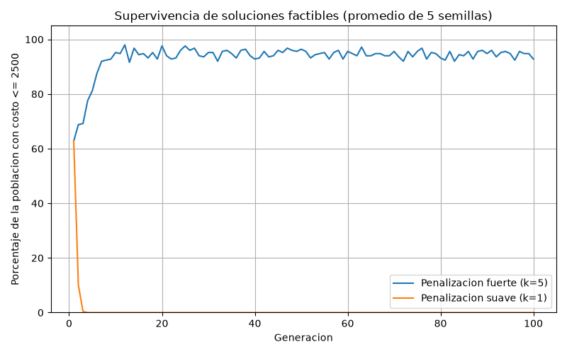
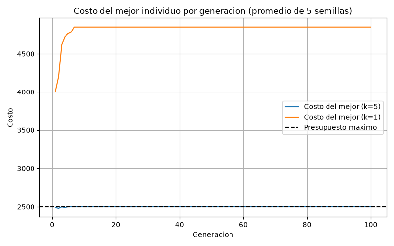
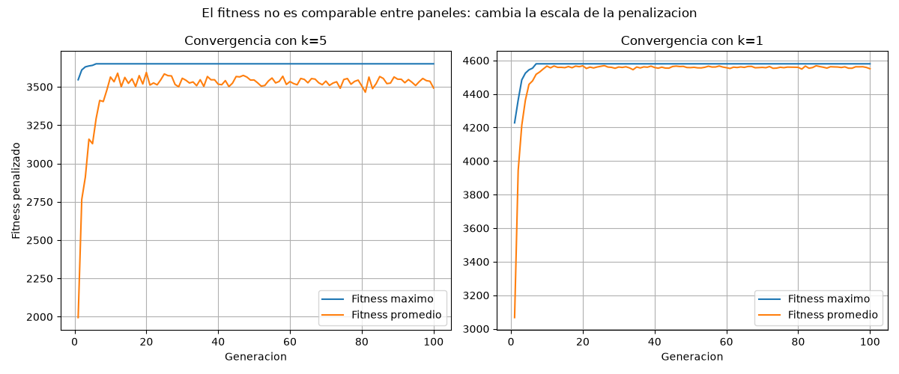

# Algoritmos Genéticos — Curso 2

Laboratorio de la Universidad de Cundinamarca. Implementación de un algoritmo genético (AG) binario y cuatro ejercicios sobre el mismo núcleo: portafolio de inversiones, selección de personal, cruzamiento de dos puntos y análisis de la penalización.

Nicolas Rodríguez Opayome y Sebastián Alexander Velásquez Maldonado

| Archivo | Contenido |
|---|---|
| `Ejercicio1portafolio.py` | Portafolio / mochila con cruzamiento de un punto y `PENALTY_FACTOR = 5` |
| `Ejercicio2seleccionPersonal.py` | Equipo de exactamente 5 candidatos |
| `Ejercicio3cruzamientoDosPuntos.py` | Mismo AG con cruzamiento de dos puntos |
| `test_cruzamiento_dos_puntos.py` | Pruebas del operador del Ejercicio 3 |
| `Ejercicio4analisisPenalizacion.py` | Experimento del Ejercicio 4 |

---

# Ejercicio 4 — Análisis de resultados: factor de penalización

La guía pide explicar **cómo el factor de penalización del Ejercicio 1 afectó la supervivencia de las soluciones, generación tras generación, frente a una penalización más suave**.

Este documento no interpreta el código a ciegas. Los números salen de:

1. Enumeración completa de los 1024 genotipos del portafolio.
2. Diez corridas reales del AG (5 semillas × 2 factores), registradas en `resultados_ejercicio4.json`.

## 1. El problema del Ejercicio 1

Hay 10 proyectos. Cada bit del cromosoma decide si se financia o no:

```text
0 = proyecto excluido
1 = proyecto seleccionado
```

Restricción: el costo total no puede superar **2500**. El objetivo es maximizar el retorno. Si se eligen todos los proyectos, el costo es **4850** y el retorno **6930**: esa solución es inválida.

La factibilidad no se impone por reparación ni por descarte. Se usa una penalización lineal sobre el exceso de presupuesto:

```text
si costo <= 2500:  fitness = retorno
si costo >  2500:  fitness = retorno − k · (costo − 2500)
```

En el Ejercicio 1, `k = 5`. Para el análisis se comparó contra `k = 1` (más suave). El resto del AG se dejó igual que en ese ejercicio:

| Parámetro | Valor |
|---|---|
| Población | 50 |
| Generaciones | 100 |
| `pc` | 0.8 |
| `pm` | 0.01 |
| Selección | torneo de tamaño 5 |
| Elitismo | sí |
| Cruzamiento | un punto |
| Semillas | 7, 11, 23, 42, 99 |

La misma semilla produce la misma población inicial en ambas condiciones. Por eso el porcentaje factible de la generación 1 coincide: **62.8 %** en los dos tratamientos. La divergencia posterior se debe solo a `k`.

El fitness **no** se compara entre `k = 5` y `k = 1`: cambia la escala. Lo que sí se compara es el costo, el retorno real (sin penalizar), si el individuo es factible y qué fracción de la población respeta el presupuesto.

## 2. Cota del problema (no es un resultado del AG)

Con 10 bits se pueden listar las 1024 soluciones.

| Magnitud | Valor |
|---|---|
| Espacio de búsqueda | 1024 |
| Soluciones factibles (`costo ≤ 2500`) | 557 |
| Óptimo factible | retorno **3700**, costo **2500**, genotipo `0110101100` |
| Proyectos del óptimo factible | B, C, E, G, H |
| Óptimo sin restricción | retorno **6930**, costo **4850**, genotipo `1111111111` |

La razón retorno/costo de cada proyecto está entre **1.25** y **1.50**. Eso importa para interpretar `k`:

- Con `k = 1`, añadir un proyecto que ya rebasa el presupuesto cambia el fitness en `retorno − costo`. Como esa diferencia es positiva en los 10 proyectos, **seleccionarlos todos** es el máximo de la función penalizada: `6930 − 1 · (4850 − 2500) = 4580`, mayor que el óptimo factible (3700).
- Con `k = 5`, el mismo genotipo vale `6930 − 5 · 2350 = −4820`. Queda por debajo de cualquier portafolio factible razonable, así que la selección por torneo deja de favorecer a los inválidos.

## 3. Resultados del AG

### 3.1 Penalización fuerte (`k = 5`, la del Ejercicio 1)

| Semilla | Genotipo | Fitness | Costo | Retorno | ¿Factible? | % factible gen. 1 | % factible gen. 100 | Primera gen. con ≥ 80 % factibles |
|---|---|---|---|---|---|---|---|---|
| 7 | `0010111000` | 3600 | 2500 | 3600 | sí | 66 | 96 | 4 |
| 11 | `0011100010` | 3650 | 2500 | 3650 | sí | 68 | 92 | 7 |
| 23 | `0110101100` | 3700 | 2500 | 3700 | sí | 64 | 96 | 4 |
| 42 | `0011100010` | 3650 | 2500 | 3650 | sí | 56 | 86 | 6 |
| 99 | `0100101010` | 3650 | 2500 | 3650 | sí | 60 | 94 | 4 |
| **Media** | — | **3650** | **2500** | **3650** | **5 / 5** | **62.8** | **92.8** | **4–7** |

La semilla 23 recuperó el óptimo enumerado. Las otras cuatro se quedaron en 3600 o 3650, siempre con costo exacto 2500.

### 3.2 Penalización suave (`k = 1`)

| Semilla | Genotipo | Fitness | Costo | Retorno | ¿Factible? | % factible gen. 1 | % factible gen. 100 | Primera gen. con ≥ 80 % factibles |
|---|---|---|---|---|---|---|---|---|
| 7 | `1111111111` | 4580 | 4850 | 6930 | no | 66 | 0 | nunca |
| 11 | `1111111111` | 4580 | 4850 | 6930 | no | 68 | 0 | nunca |
| 23 | `1111111111` | 4580 | 4850 | 6930 | no | 64 | 0 | nunca |
| 42 | `1111111111` | 4580 | 4850 | 6930 | no | 56 | 0 | nunca |
| 99 | `1111111111` | 4580 | 4850 | 6930 | no | 60 | 0 | nunca |
| **Media** | — | **4580** | **4850** | **6930** | **0 / 5** | **62.8** | **0.0** | **nunca** |

Las cinco corridas convergieron al portafolio completo. El fitness 4580 es más alto que 3700, pero la solución viola el presupuesto en 2350.

## 4. Supervivencia generación tras generación

Promedio de las 5 semillas. En la generación 1 ambas condiciones parten del **mismo** 62.8 % factible; a partir de ahí el mejor individuo ya no es el mismo, porque `k` cambia quién gana el torneo.

| Generación | % factible (`k = 5`) | Costo del mejor (`k = 5`) | % factible (`k = 1`) | Costo del mejor (`k = 1`) |
|---|---|---|---|---|
| 1 | 62.8 | 2490 | 62.8 | 4010 |
| 2 | 68.8 | 2480 | 10.0 | 4200 |
| 4 | 77.6 | 2490 | 0.0 | 4720 |
| 5 | 81.2 | 2500 | 0.0 | 4760 |
| 7 | 92.0 | 2500 | 0.0 | 4850 |
| 10 | 95.2 | 2500 | 0.0 | 4850 |
| 25 | 97.6 | 2500 | 0.0 | 4850 |
| 50 | 96.4 | 2500 | 0.0 | 4850 |
| 100 | 92.8 | 2500 | 0.0 | 4850 |

Con `k = 5`, el mejor de cada generación fue factible en el **100 %** de las observaciones (5 semillas × 100 generaciones). Con `k = 1`, el mejor fue factible en el **0 %**.







### Qué ocurre con `k = 5`

Desde la primera generación el torneo elige un individuo factible (costo medio del mejor: 2490). El porcentaje factible sube de 62.8 % a 81.2 % en 5 generaciones y se estabiliza cerca del 93 %. No llega al 100 % de forma permanente: la mutación (`pm = 0.01`) sigue inyectando bits que rompen el presupuesto, pero esos individuos pierden el torneo y no desplazan al elite.

En otras palabras, las soluciones inválidas **no desaparecen del todo**, pero **dejan de sobrevivir como padres dominantes**. El elitismo conserva un factible de costo 2500 y la población se concentra alrededor de ese frente.

### Qué ocurre con `k = 1`

En la generación 1 el mejor ya es inválido (costo medio 4010, retorno 5738). Su fitness penalizado sigue por encima del de los factibles, así que el torneo y el elitismo lo copian. En una sola generación el porcentaje factible cae de 62.8 % a **10 %**. En la generación 4 la población factible es **0 %**. En la generación 7 el mejor ya es `1111111111` (costo 4850).

Las soluciones factibles no “pierden calidad”: son expulsadas porque la función objetivo, con `k` por debajo de la razón retorno/costo, **premia** el exceso de presupuesto.

## 5. Conclusión

El `PENALTY_FACTOR = 5` del Ejercicio 1 sí cambia la supervivencia. Con la misma población inicial, la penalización fuerte hace que los factibles pasen de ~63 % a ~93 % en menos de diez generaciones y que el mejor global sea válido en 5 de 5 corridas (retorno medio 3650, una de ellas en el óptimo 3700). La penalización suave `k = 1` invierte el proceso: los factibles se extinguen entre las generaciones 2 y 4, y las cinco corridas terminan en el portafolio ilegal de retorno 6930.

Una penalización “más suave” no es solo un ajuste numérico. Si `k` queda por debajo de la rentabilidad de los proyectos, el AG maximiza correctamente una función **equivocada** para el negocio: sobrevive quien más viola la restricción.

Limitación: cinco semillas bastan para ver el contraste, no para estimar varianza fina. El hallazgo es cualitativamente idéntico en las cinco repeticiones.

## 6. Cómo reproducir

```text
python Ejercicio4analisisPenalizacion.py
```

Salidas: `resultados_ejercicio4.json`, `comparacion_factibilidad_ejercicio4.png`, `comparacion_costo_ejercicio4.png` y `comparacion_fitness_ejercicio4.png`.
